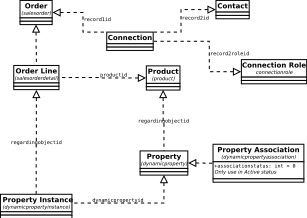

## Synchronise Active Directory Users to Dynamics as Contacts

These contacts are different to normal contact created directly in Dynamics because they are also a product those Contacts bought.

### Dependencies

System.Json
```
dotnet add package System.Json
```

#### AD

The package [System.DirectoryServices](https://dotnet.myget.org/feed/dotnet-core/package/nuget/System.DirectoryServices) is in *myget* instead of *nuget*.
But it has been planned to be released in 2.1 for Windows.

There is no implementation for [Linux even System.DirectoryServices.Protocol is doable](https://github.com/dotnet/corefx/issues/2089#issuecomment-327276236).
The development of this topic is on [github.com](https://github.com/dotnet/corefx/issues/2089). There is an [alternative solution](https://github.com/dsbenghe/Novell.Directory.Ldap.NETStandard).

To install from *myget*:

```shell
dotnet add package System.DirectoryServices -s "https://dotnet.myget.org/F/dotnet-core/api/v3/index.json" -v 4.5.0-preview2-25707-02
```

### Entities

Major entities are listed below. Some entities e.g. _Connection_ shown in the diagram are only helpers which are not visible to end users.

#### Contact
#### Product
#### Order
#### Orderline
#### Price list



### Notes

#### Create related entities in one operation

Base on [MSDN](https://msdn.microsoft.com/en-us/library/gg328090.aspx#bkmk_CreateRelated), you can create
do it by _deep insert_ if there are __collection-valued navigation properties__ can be used.

##### Request

```shell
POST [Organization URI]/api/data/v8.2/accounts HTTP/1.1
Content-Type: application/json; charset=utf-8
OData-MaxVersion: 4.0
OData-Version: 4.0
Accept: application/json

{
 "name": "Sample Account",
 "primarycontactid":
 {
     "firstname": "John",
     "lastname": "Smith"
 },
 "opportunity_customer_accounts":
 [
  {
      "name": "Opportunity associated to Sample Account",
      "Opportunity_Tasks":
      [
       { "subject": "Task associated to opportunity" }
      ]
  }
 ]
}
```

#### Response

```shell
HTTP/1.1 204 No Content
OData-Version: 4.0
OData-EntityId: [Organization URI]/api/data/v8.2/accounts(3c6e4b5f-86f6-e411-80dd-00155d2a68cb)
```

#### Associate entities on create

Base on [MSDN](https://msdn.microsoft.com/en-us/library/gg328090.aspx#bkmk_associateOnCreate), you use
__@odata.bind__ to associate an existing entity. You use __single-valued navigation property
__ to define the link like this:

```shell
POST [Organization URI]/api/data/v8.2/accounts HTTP/1.1
Content-Type: application/json; charset=utf-8
OData-MaxVersion: 4.0
OData-Version: 4.0
Accept: application/json

{
"name":"Sample Account",
"primarycontactid@odata.bind":"/contacts(00000000-0000-0000-0000-000000000001)"
}
```

See [Web API EntityType Reference](https://msdn.microsoft.com/en-us/library/mt607894.aspx#bkmk_CollectionValuedNavigationProperties) for what
__single-valued navigation properties__ or __collection-value navigation properties__ to use with entities.